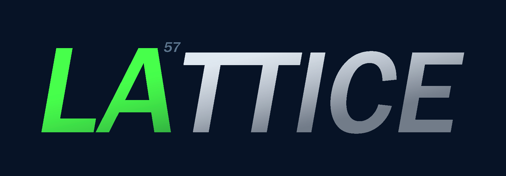

# LatticeLab

  

  Интерактивная симуляция материи на движке <b>LATTICE</b>.

  

---

## О проекте

LatticeLab — это desktop-приложение, где можно экспериментировать с атомами в реальном времени.

Идея простая:

> задать базовые правила взаимодействия частиц и посмотреть, что из этого получится

Без заранее прописанных эффектов.  
Только частицы и силы между ними.

Но этого уже достаточно, чтобы система сама начала вести себя как настоящая материя.

---

## Что можно наблюдать

- самообразование кристаллов
- диффузию частиц
- колебания решётки, волны и фононоподобные режимы
- появление зёрен и границ между доменами
- дефекты упаковки и локальные искажения решётки
- зарождение неоднородностей
- Волны, фононы, интерференция
- локальное упорядочивание и разрушение структуры
- поведение, похожее на твёрдые тела, жидкости и переходные состояния
- релаксацию после столкновений, сжатия или изменения параметров

---

## Планы

- молекулы и химические реакции  
- заряженные частицы и кулоновские силы  
- металлы и сплавы  
- проводимость и токи  
- более сложные физические модели  

---

## Зачем это

Обычно физика — это формулы.

Здесь можно увидеть, как из простых взаимодействий рождается сложное поведение

- для обучения  
- для экспериментов  
- для понимания материи  

---

## Ссылки

#### [Канал на YouTube](https://www.youtube.com/@ElectroChajnik)
#### [Проект на GitHub](https://github.com/ElectroZybr/Chemical-simulator)
#### [Поддержать проект](https://www.donationalerts.com/r/electrozybr)